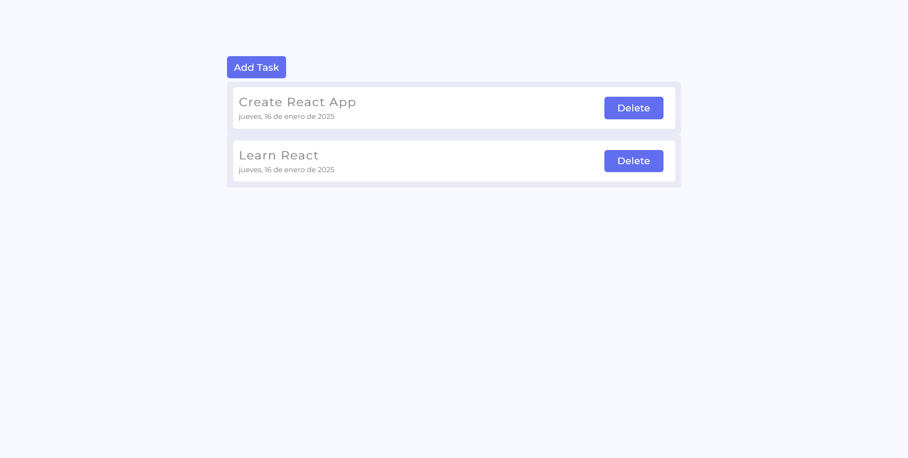
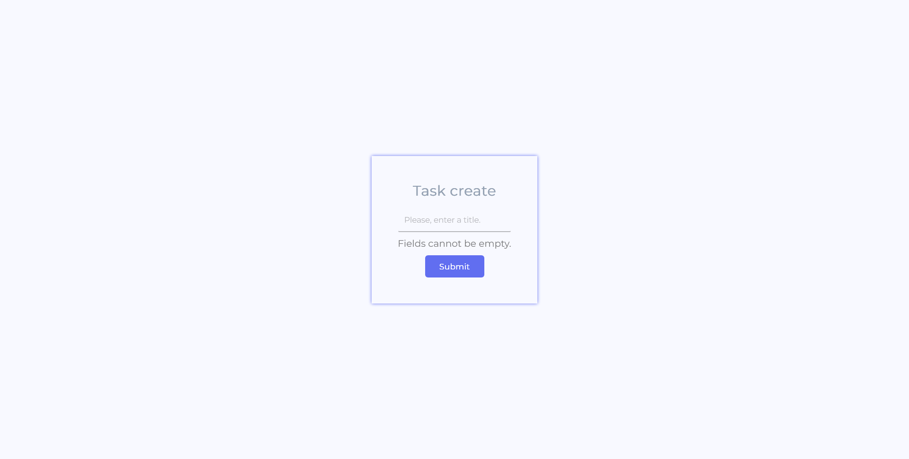
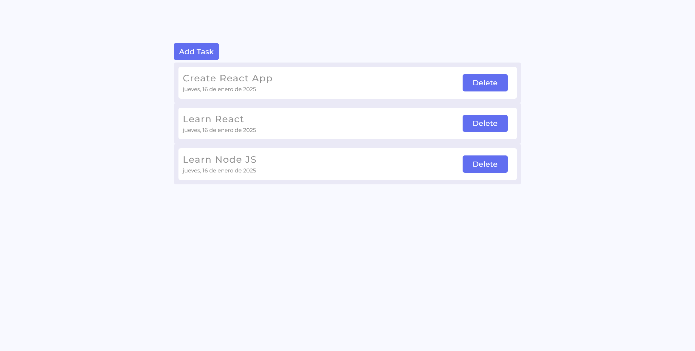

## Query, request and views

  + GET
    * "*/*": Muestra todas las tareas alojadas en archivo JSON // Shows all tasks hosted on archive JSON.
    * "*/create": Muestra la vista del formulario // Show the view of the form.
    
  + POST
    * "*/form*": Agrega una nueva tarea al archivo JSON // Add a new task to the archive JSON.
    
  + DELETE
    * "*/delete/:id*": Elimina la tarea seleccionada por id // Delete the task selected by id.

## Frontend

## Frontend

  

  

  

  <!-- Esto agrega un salto de línea -->
  <!-- Esto agrega un salto de línea -->
>Este es el proceso de la página. Cuando apretas "AddTask", te dirije al apartado /create, dónde se llena con una nueva tarea, y esta, es posteriormente agregada a la lista. // This is the process of the page. When you
press "AddTask", you go to the /create section, where it is filled with a new task, and this is then added to the list. 

## Express y JSON
 
 
 
## POO
* Proyecto realizado con POO (Programación orientada a objetos). El proyecto también cuenta con variables de entorno, routes, services y controllers.
* Project developed with OOP (Object Oriented Programming). The project also has environment variables, routes, services and controllers.  
